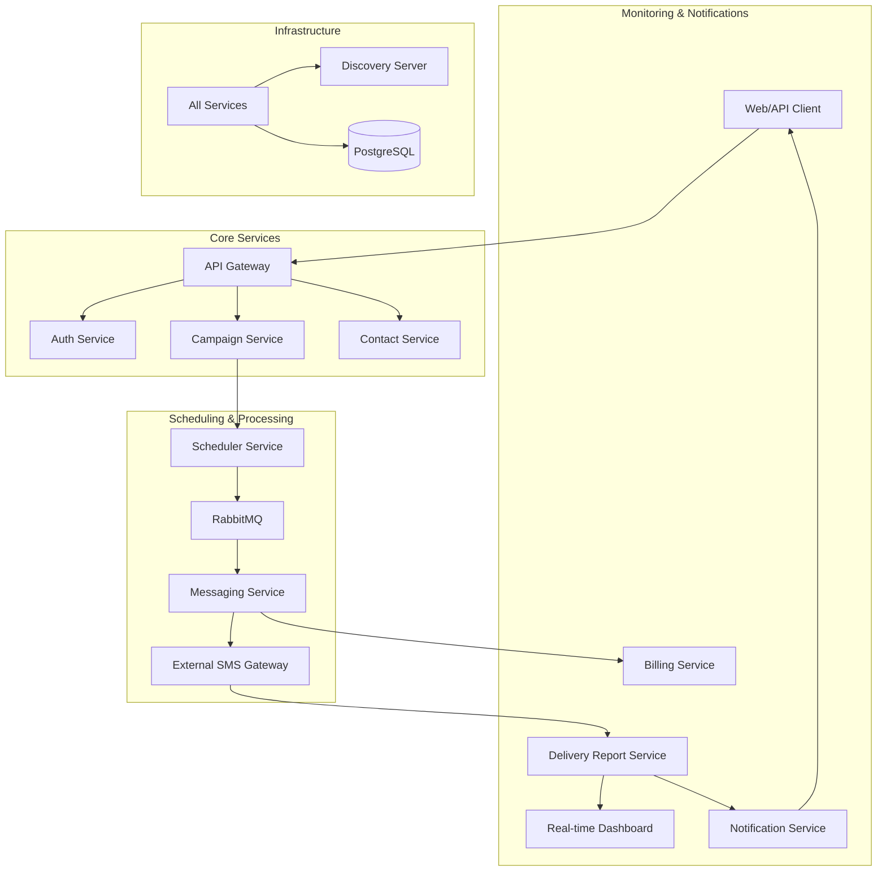

# 🌌 NotifyGrid

**Enterprise-grade bulk messaging architecture, simplified.**

---

NotifyGrid is a high-performance, microservices-based Bulk SMS Service System designed for reliability, scalability, and ease of integration.

[Features](#-key-pillars) • [Architecture](#-architecture) • [Quick Start](#-getting-started) • [Demo](#-quick-demo)

## ✨ Key Pillars

| 🛡️ Secure | 🚀 Scalable | 📊 Insightful |
| :--- | :--- | :--- |
| JWT-based RBAC and encrypted communication channels. | Independent microservices ready for horizontal growth. | Real-time delivery reports and billing tracking. |

---

## 🏗️ Architecture

NotifyGrid follows a decoupled microservices architecture coordinated via a centralized Discovery Server and API Gateway.

## 🛠️ Tech Stack

- **Language:** Java 23 (JDK 23)
- **Framework:** Spring Boot 4.0.6, Spring Cloud 2025.1.1
- **Messaging:** RabbitMQ (Asynchronous processing)
- **Database:** PostgreSQL (Relational persistence)
- **DevOps:** Docker & Docker Compose
- **Scripting:** Python 3.x (System Orchestration)

### 📡 Service Map

| Service | Port | Responsibility |
| :--- | :--- | :--- |
| **Discovery Server** | `8761` | Service registration and discovery (Eureka) |
| **API Gateway** | `8080` | Centralized request routing |
| **Auth Service** | `8081` | JWT-based authentication and security |
| **Campaign Service** | `8084` | Campaign lifecycle and scheduling |
| **Scheduler Service** | `8089` | Triggering scheduled campaigns |
| **Messaging Service** | `8085` | Queue processing and provider integration |
| **Notification Service** | `8088` | Alerts and completion notifications |
| **Frontend** | `8000` | Management Dashboard |

---

