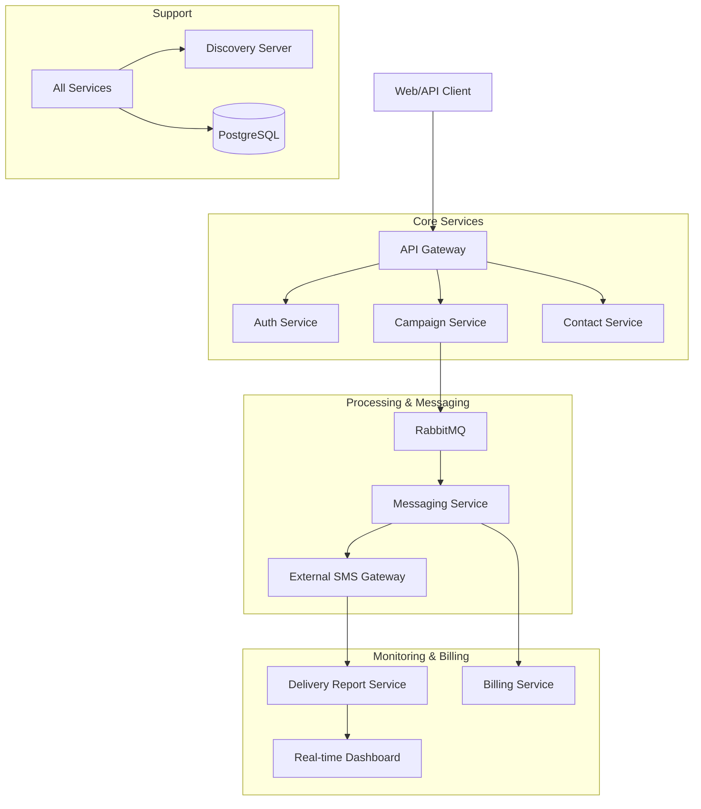

# NotifyGrid README Implementation Plan

> **For agentic workers:** REQUIRED SUB-SKILL: Use superpowers:subagent-driven-development (recommended) or superpowers:executing-plans to implement this plan task-by-task. Steps use checkbox (`- [ ]`) syntax for tracking.

**Goal:** Create a high-impact, modern, and minimalist README.md for NotifyGrid.

**Architecture:** The README will use a centered hero section, Mermaid.js for architecture visualization, and a clean structured layout to present the microservices ecosystem.

**Tech Stack:** Markdown, Mermaid.js, GitHub Badges.

---

### Task 1: Initialize README and Hero Section

**Files:**
- Create: `README.md`

- [ ] **Step 1: Create the base README with Hero Header**

```markdown
<div align="center">

# 🌌 NotifyGrid

**Enterprise-grade bulk messaging architecture, simplified.**

[](https://openjdk.org/projects/jdk/23/)
[](https://spring.io/projects/spring-boot)
[](LICENSE)

---

NotifyGrid is a high-performance, microservices-based Bulk SMS Service System designed for reliability, scalability, and ease of integration.

[Features](#-key-pillars) • [Architecture](#-architecture) • [Quick Start](#-getting-started) • [Demo](#-quick-demo)

</div>
```

- [ ] **Step 2: Verify file creation**

Run: `ls README.md`
Expected: File exists.

- [ ] **Step 3: Commit**

```bash
git add README.md
git commit -m "docs: initialize NotifyGrid README with hero section"
```

---

### Task 2: Add Core Vision and Key Pillars

**Files:**
- Modify: `README.md`

- [ ] **Step 1: Add the "Key Pillars" section**

```markdown
## ✨ Key Pillars

<div align="center">

| 🛡️ Secure | 🚀 Scalable | 📊 Insightful |
| :--- | :--- | :--- |
| JWT-based RBAC and encrypted communication channels. | Independent microservices ready for horizontal growth. | Real-time delivery reports and billing tracking. |

</div>

---
```

- [ ] **Step 2: Commit**

```bash
git add README.md
git commit -m "docs: add core vision and key pillars to README"
```

---

### Task 3: Implement Architecture Diagram (Mermaid.js)

**Files:**
- Modify: `README.md`

- [ ] **Step 1: Add the Mermaid.js architecture diagram**

```markdown
## 🏗️ Architecture

NotifyGrid follows a decoupled microservices architecture coordinated via a centralized Discovery Server and API Gateway.



---
```

- [ ] **Step 2: Commit**

```bash
git add README.md
git commit -m "docs: add architecture diagram to README"
```

---

### Task 4: Tech Stack and Service Map

**Files:**
- Modify: `README.md`

- [ ] **Step 1: Add Tech Stack and Service Map tables**

```markdown
## 🛠️ Tech Stack

- **Language:** Java 23 (JDK 23)
- **Framework:** Spring Boot 4.0.6, Spring Cloud 2025.1.1
- **Messaging:** RabbitMQ (Asynchronous processing)
- **Database:** PostgreSQL (Relational persistence)
- **DevOps:** Docker & Docker Compose
- **Scripting:** Python 3.x (System Orchestration)

### 📡 Service Map

| Service | Port | Responsibility |
| :--- | :--- | :--- |
| **Discovery Server** | `8761` | Service registration and discovery (Eureka) |
| **API Gateway** | `8080` | Centralized request routing |
| **Auth Service** | `8081` | JWT-based authentication and security |
| **Campaign Service** | `8084` | Campaign lifecycle and scheduling |
| **Messaging Service** | `8085` | Queue processing and provider integration |
| **Frontend** | `8000` | Management Dashboard |

---
```

- [ ] **Step 2: Commit**

```bash
git add README.md
git commit -m "docs: add tech stack and service map to README"
```

---

### Task 5: Getting Started and Quick Demo

**Files:**
- Modify: `README.md`

- [ ] **Step 1: Add Quick Start and Demo sections**

```markdown
## 🚀 Getting Started

### Prerequisites
- [Docker Desktop](https://www.docker.com/products/docker-desktop/)
- [Java 23 JDK](https://openjdk.org/projects/jdk/23/)
- [Python 3.x](https://www.python.org/)

### One-Command Start
NotifyGrid includes an orchestration script to start the entire ecosystem (Infrastructure, Microservices, and Frontend) with one command:

```bash
python run_system.py
```

### 📱 Quick Demo
Once the system is running:
1.  **Dashboard:** Navigate to `http://localhost:8000`.
2.  **Eureka:** Monitor service health at `http://localhost:8761`.
3.  **Workflow:** 
    - Upload a CSV of contacts in the **Contact Service**.
    - Create a new **Campaign** and set the schedule.
    - View real-time **Delivery Reports** as messages are processed.

---

<div align="center">
Made with ❤️ for the Modern Web
</div>
```

- [ ] **Step 2: Commit**

```bash
git add README.md
git commit -m "docs: finalize README with getting started and demo sections"
```
